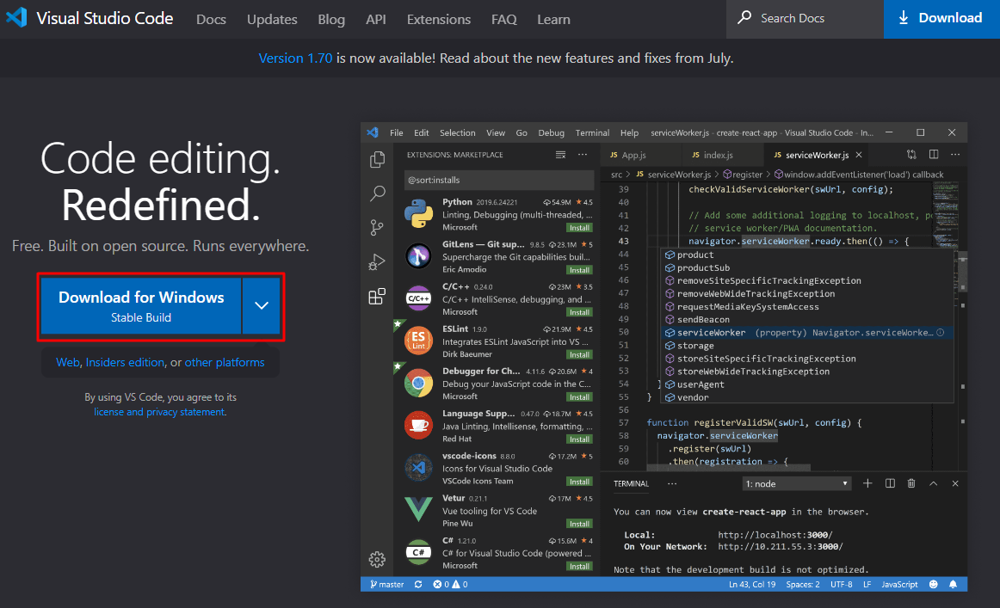
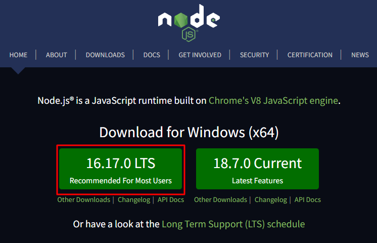

# Pré requisitos

Para iniciarmos o curso nós precisaremos instalar tanto um editor de código bacana para facilitar nossa vida (VSCode) e tambem o Node que é, para simplificarmos, um programa para rodar os códigos que desenvolvermos

## Visual Studio Code ou VSCode

É um dos editores de código mais conhecidos atualmente, ele irá facilita o desenvolvimento de códigos alem de proporcionar extensões das mais diversar para melhorarmos ainda mais nossa experiencia de uso.

Para instalarmos ele nos podemos acessar o link abaixo e instala-lo conforme a prática mais famosa para instalar programar, que é apertar Next, Next, Next até chegar ao fim kkk
Brincadeiras a parte a sua instalação é bem fácil e intuitiva!

[VSCode](https://code.visualstudio.com)

## Node

Para facilitarmos o entendimento atualmente, o Node é um programa que instalamos na nossa máquina para executarmos códigos escritos em Javascript.
O link para baixa-lo é este abaixo, sendo quase o mesmo processo anterior de instalar o VSCode

[Node](https://nodejs.org/en)

