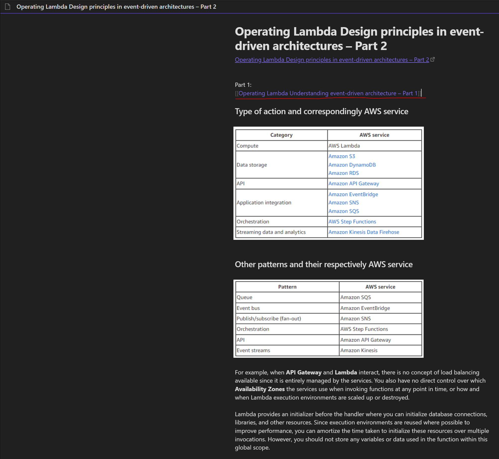
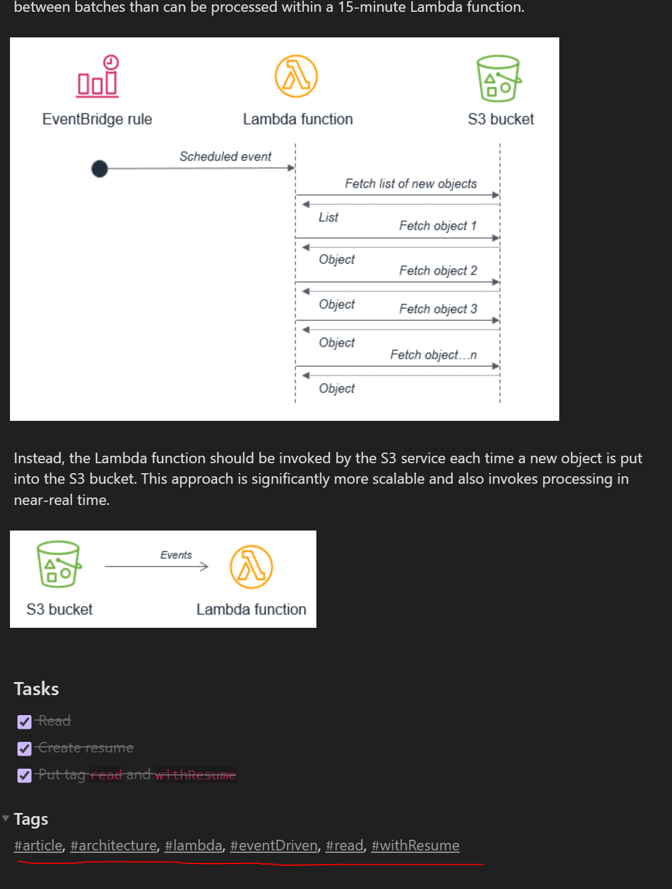
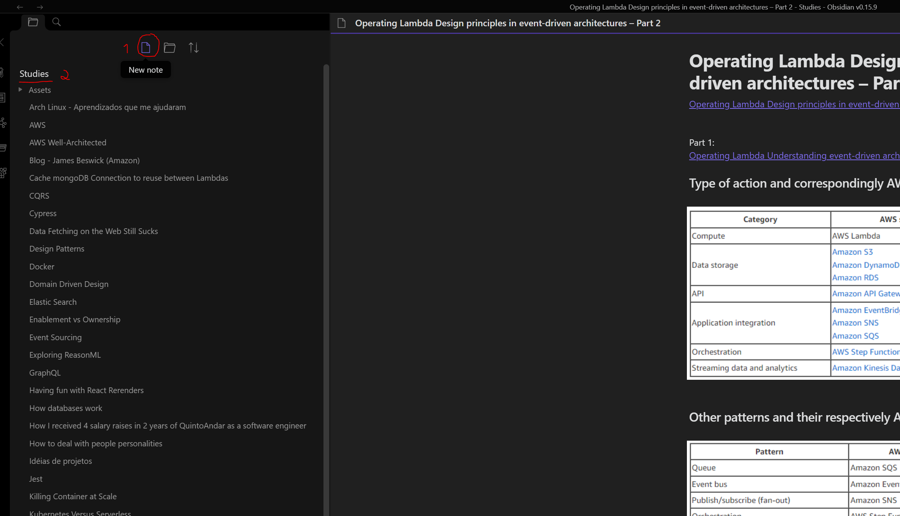

# Anotações

Este conteudo do curso é opcional, porem eu altamente recomendo a todos dar pelo menos uma olhada!

Hoje em dia a quantidade de conteudos que temos por causa da internet é gigante, onde é impossível conseguir ler tudo mesmo que façamos isto durante 24 horas todos os 7 dias da semana. Levando em conta isto, nos devemos sempre nos organizar para consumir conteudos relevantes para nós que agreguem em nosso conhecimento, porem mesmo quando estamos estudando assuntos relevantes, nós acabamos perdendo o conhecimento aos poucos depois de um tempo, o que é normal visto a como o ser humano é.

Com base nisso, é muito proveitoso ter sempre algum resumo dos conteudos que lemos, assistimos ou somente escutamos, pois assim descrevemos eles da nossa própria maneira e de uma forma fácil de buscar e revisar quando necessário, local onde o Obsidian entra para facilitar nossa vida.

## Obsidian

Obsidian é uma ferramenta para anotar informações, sendo como um bloco de notas com funcionalidades avançadas.
A vantagem de usá-lo é que ele proporciona formas de relacionar uma anotação com outra, Um bom exemplo disto seria uma sequencia de artigos com 3 partes, no qual vc poderia relacionar as 3 anotações dos 3 artigos para facilitar a busca dos resumos.

Outra vantagem é a utilização de tags para categorizar conteudos, como por exemplo conteudos relacionados a introdução a programação, assim quando você precisar buscar suas anotações sobre o tema/categoria, você encontrará eles muito mais facilmente para revisar o conteúdo.

A ferramenta consegue trabalhar com Markdown, forma de escrita na qual esta documentação do curso esta sendo feita, porem como seria mais um tema a ser estudado e fora do nosso foco atual de programação, eu recomendo que vocês revisitem o tema Markdown futuramente quando estiverem se sentindo confortável com as aulas e que podem buscar um segundo assunto para estudar.

Existem multiplas formas de tirar mais proveito da ferramente, porem este seria o essencial para conseguirem fazer suas anotações e registrarem seus aprendizados.

### Forma de uso

O Obsidian pedirá para criarmos um diretório/pasta em nosso computador para gravar os arquivos relacionados as nossas anotações, quase como uma pasta que contem vários blocos de notas, após isto nos poderemos criar as notas e realizar nossos resumos como o planejado

1. Botão para criar uma nova anotação
2. Título da nossa pasta que criamos inicialmente com o obsidian, podendo ser colocado como "Estudos"
